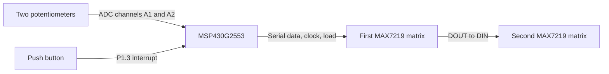

# Pong on the MSP430

A two-player **Pong game in C** for the **MSP430G2553**, displayed across two daisy-chained **MAX7219 8×8 LED matrices**. Each player controls a paddle with a 10 kΩ potentiometer, while a push button handles menu selection and pause/resume.

Developed as the final project for **Sistemas Microcontrolados — 2025/2** at UTFPR. The implementation uses direct peripheral register access, interrupt-driven timing, ADC sampling, and serial display updates.

## Game features

- A scrolling title animation across the two matrices.
- Two modes with different paddle sizes and update intervals.
- Analog paddle control, averaging eight ADC readings per channel.
- Ball movement, wall/paddle collisions, and scoring.
- First player to reach **three points** ends the match; the score is displayed before returning to the title.
- A single button for progressing through the menus and pausing/resuming play.

## System overview



The two matrices form a logical **16×8 playfield**. Timer_A schedules game updates, the ADC10 samples the controls, and USCI_B0 sends pixel data to the display chain.

## Repository layout

```text
pongGame/
├── src/
│   └── pongGame.c             # Original firmware
├── docs/
│   ├── hardware.md            # Parts, pin mapping, and display chain
│   ├── build-and-play.md      # Build, flash, and player controls
│   └── firmware.md            # Architecture, timing, and implementation notes
├── .gitignore
└── README.md
```

## Getting started

1. Follow the [hardware guide](docs/hardware.md) to assemble the two displays, potentiometers, and button. It includes the interface voltage requirements.
2. Create an MSP430G2553 firmware project with a compatible MSP430 toolchain, add [src/pongGame.c](src/pongGame.c), and build/flash the board as described in [Build and play](docs/build-and-play.md).
3. Watch the title animation, press the button to enter mode selection, then press again when the desired mode is displayed.
4. Press to begin play and rotate the potentiometers to move the paddles. Further presses pause/resume the match.

## How the firmware works

| Component | Responsibility |
| --- | --- |
| ADC10 + data transfer controller | Collects eight readings, computes an average, and alternates between the two potentiometers |
| Timer_A0 | Debounces the button by temporarily disabling its interrupt |
| Timer_A1 | Triggers control sampling and game/display updates |
| USCI_B0 | Sends two address/data pairs per display transaction |
| Display buffers | Store each matrix's eight bytes before drawing paddles and the ball |

See [Firmware architecture](docs/firmware.md) for function responsibilities, mode parameters, timing, and known implementation details.

## Project status

The firmware is preserved from the original submission. This repository update adds organization and documentation; it does not change gameplay. No compiler project, schematic, hardware photographs, or gameplay recording was included in the original repository. The code has not been rebuilt or tested on hardware during this update. Pause/resume currently reinitializes the ball, and the collision ranges differ from the drawn paddle sizes; these behaviors are documented in the firmware guide.

## Author

Maintained by **Pedro Augusto Merisio**. Original Portuguese comments and identifiers are retained in the source. No license file was present in the original repository.
